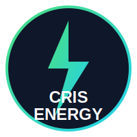
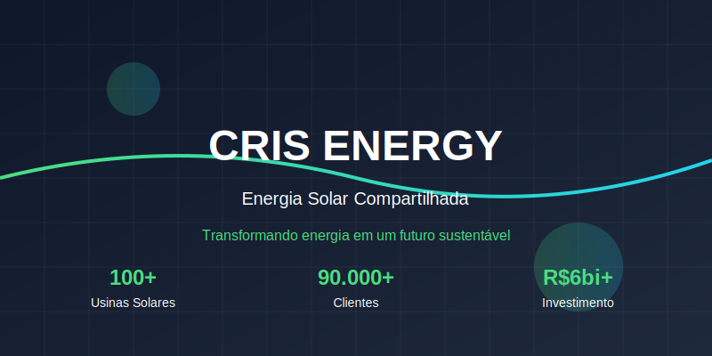
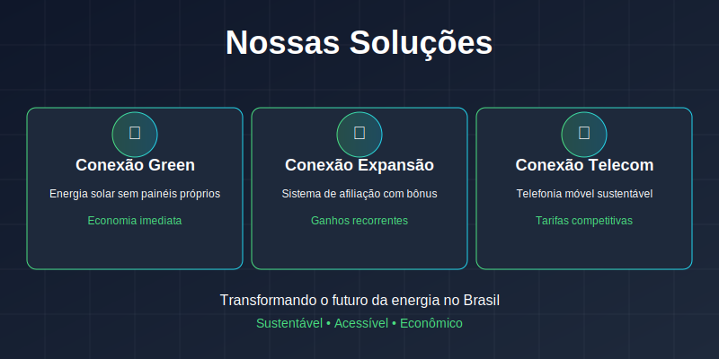

<div align="center">
  

  # ⚡ CRIS ENERGY ⚡

  ### *Transformando energia em um futuro sustentável*

  [](https://nextjs.org/)
  [](https://reactjs.org/)
  [](https://www.typescriptlang.org/)
  [](https://tailwindcss.com/)
  [](https://threejs.org/)
</div>

<div align="center">
  
</div>

## 📋 Sobre o Projeto

**CRIS ENERGY** é uma plataforma moderna e inovadora focada em soluções de energia solar compartilhada. Nosso objetivo é democratizar o acesso à energia limpa e sustentável através de tecnologias avançadas e práticas sustentáveis.

<table>
  <tr>
    <td align="center"><h3>🌞 100+</h3>Usinas Solares</td>
    <td align="center"><h3>👥 90.000+</h3>Clientes</td>
    <td align="center"><h3>💰 R$6bi+</h3>Investimento</td>
  </tr>
</table>

## 🚀 Funcionalidades Principais

<div align="center">
  
</div>

### 🔌 Conexão Green
Sistema que permite clientes se conectarem à energia solar sem investir em painéis próprios. A CRIS ENERGY injeta a energia gerada em suas usinas na rede da distribuidora, proporcionando economia sem investimentos iniciais.

### 🔄 Conexão Expansão
Sistema de expansão da rede de licenciados com bônus por afiliação. Licenciados podem conectar novos licenciados diretamente ou por meio de sua equipe, recebendo bônus imediatos e recorrentes proporcionais à atividade e desempenho da sua rede.

### 📱 Conexão Telecom
Soluções de telefonia móvel com práticas sustentáveis. A operadora adota práticas ecológicas que contribuem para a preservação do meio ambiente, alinhando-se aos princípios da energia verde, com tarifas competitivas e planos adaptáveis.

## 💡 Benefícios

- **Economia Significativa**: Reduza até 95% na conta de energia
- **Sem Investimento Inicial**: Não é necessário instalar painéis solares
- **Monitoramento em Tempo Real**: Acompanhe seu consumo de energia solar
- **Créditos de Energia**: Aplicados diretamente na sua conta de luz
- **Sustentabilidade**: Contribua para um planeta mais verde

## 🛠️ Tecnologias Utilizadas

Este projeto foi construído com tecnologias de ponta para garantir performance, escalabilidade e uma experiência de usuário excepcional:

### Frontend
- **Next.js 15.2.0**: Framework React com renderização híbrida e otimizações de performance
- **React 19.0.0**: Biblioteca JavaScript para construção de interfaces de usuário
- **TypeScript 5**: Superset tipado de JavaScript para desenvolvimento mais seguro
- **Tailwind CSS 4**: Framework CSS utilitário para design rápido e responsivo

### Visualização e Animação
- **Three.js & React Three Fiber**: Biblioteca 3D para visualizações interativas
- **Framer Motion**: Biblioteca de animações para React
- **GSAP**: Biblioteca de animação profissional para web

### UI/UX
- **Lucide React**: Conjunto de ícones limpos e consistentes
- **React Hook Form**: Gerenciamento de formulários com validação
- **Sonner**: Biblioteca de notificações toast minimalista

## 💻 Instalação e Uso

```bash
# Clone o repositório
git clone https://github.com/Jeanfr1/crisenergy.git

# Entre no diretório do projeto
cd crisenergy

# Instale as dependências
npm install

# Inicie o servidor de desenvolvimento
npm run dev
```

Acesse [http://localhost:3000](http://localhost:3000) no seu navegador para ver o resultado.

## 🏗️ Estrutura do Projeto

```
crisenergy/
├── public/            # Arquivos estáticos
├── src/
│   ├── app/           # Configuração do Next.js App Router
│   ├── components/    # Componentes React reutilizáveis
│   │   ├── 3d/        # Componentes de visualização 3D
│   │   ├── layout/    # Componentes de layout (Navbar, Footer)
│   │   ├── sections/  # Seções principais da página
│   │   └── ui/        # Componentes de UI reutilizáveis
```

## 📞 Contato

<table>
  <tr>
    <td>
      <strong>Email:</strong> <a href="mailto:crisrenovaveis@gmail.com">crisrenovaveis@gmail.com</a><br>
      <strong>WhatsApp:</strong> <a href="https://wa.me/5534998288579">(34) 99828-8579</a><br>
      <strong>Endereço:</strong> R. Tupaciguara, 274 - Nossa Sra. Aparecida, Uberlândia - MG, 38400-618
    </td>
  </tr>
</table>

## 📄 Licença

Este projeto está licenciado sob a Licença MIT - veja o arquivo LICENSE para detalhes.

---

<div align="center">
  <p>
    <a href="https://www.facebook.com/igreen.energy.facebook#" target="_blank">
      
    </a>
    <a href="https://www.instagram.com/crisrenovaveis/" target="_blank">
      
    </a>
    <a href="mailto:crisrenovaveis@gmail.com">
      
    </a>
  </p>
  <p>Desenvolvido com ❤️ por Jean Pereira</p>
</div>
